# Amstrad CPC Debug — VS Code Extension

> 🇫🇷 [Version française disponible](README.fr.md)

A VS Code debugging extension for **Amstrad CPC** Z80 development (CPC 464 / 664 / 6128 / CPC+).

The extension acts as a Debug Adapter Protocol (DAP) bridge between VS Code and a CPC emulator. It connects to the emulator over a JSON/TCP protocol documented in [`EMULATOR_INTERFACE.md`](EMULATOR_INTERFACE.md), making it compatible with any emulator that implements this protocol.

The reference emulator is **[SugarboxV2](https://github.com/Tom1975/SugarboxV2)**.

---

## Table of contents

- [Requirements](#requirements)
- [Installation](#installation)
  - [From VSIX](#from-vsix)
  - [Installing the build tools](#installing-the-build-tools)
  - [Build from source](#build-from-source)
- [Quick start](#quick-start)
- [Configuration](#configuration)
  - [Launch mode](#launch-mode-recommended)
  - [Attach mode](#attach-mode)
  - [Properties reference](#properties-reference)
- [Usage](#usage)
  - [Execution control](#execution-control)
  - [Source-level debugging](#source-level-debugging)
  - [Disassembly view](#disassembly-view)
  - [Breakpoints](#breakpoints)
  - [Registers and stack](#registers-and-stack)
  - [Memory view](#memory-view)
  - [Hardware panels](#hardware-panels)
  - [Virtual keyboard](#virtual-keyboard)
  - [Screen panel](#screen-panel)
  - [Quick Launch](#quick-launch)
  - [Project creation](#project-creation)
  - [Hex editor](#hex-editor)
- [Architecture](#architecture)
- [Emulator compatibility](#emulator-compatibility)
- [Conformance tests](#conformance-tests)
- [Known limitations](#known-limitations)

---

## Requirements

- [VS Code](https://code.visualstudio.com/) 1.108+
- A CPC emulator supporting the TCP debug protocol (see [`EMULATOR_INTERFACE.md`](EMULATOR_INTERFACE.md))
- [RASM](http://www.rasm.assemble.tf/) (recommended Z80 assembler)
- Node.js 18+ and npm (only needed to build the extension from source)
- Python 3 (only needed to package the `.vsix` via `make_vsix.py` — stdlib only, no pip packages required)

---

## Installation

### From VSIX

```bash
code --install-extension amstrad-cpc-debug-0.0.3.vsix
```

### Installing the build tools

<details>
<summary><strong>Windows</strong></summary>

```powershell
winget install OpenJS.NodeJS.LTS
winget install Python.Python.3.12
winget install Microsoft.VisualStudioCode
```

On Windows the Python launcher is usually `python`, not `python3` — use `python make_vsix.py` in the build step below.

`RASM` has no Windows package — download `rasm.exe` from [rasm.assemble.tf](http://www.rasm.assemble.tf/) and either add its folder to `PATH` or point the `z80debug.rasm` setting / `RASM` environment variable to it.

</details>

<details>
<summary><strong>Linux (Debian/Ubuntu)</strong></summary>

```bash
sudo apt update
sudo apt install nodejs npm python3
```

The Node.js version shipped by `apt` can be old; if `node --version` is below 18, install a current one via [nvm](https://github.com/nvm-sh/nvm) instead:

```bash
curl -o- https://raw.githubusercontent.com/nvm-sh/nvm/v0.40.1/install.sh | bash
nvm install --lts
```

Install VS Code from the [official `.deb`/apt repository](https://code.visualstudio.com/docs/setup/linux) or via `snap install code --classic`.

`RASM` has no apt package — download the Linux binary from [rasm.assemble.tf](http://www.rasm.assemble.tf/), `chmod +x` it, and put it on your `PATH` (or set the `RASM` environment variable / `z80debug.rasm` setting to its path).

</details>

<details>
<summary><strong>macOS</strong></summary>

```bash
brew install node python3
brew install --cask visual-studio-code
```

`RASM` has no Homebrew formula — download the macOS binary from [rasm.assemble.tf](http://www.rasm.assemble.tf/), `chmod +x` it, and put it on your `PATH` (or set the `RASM` environment variable / `z80debug.rasm` setting to its path). You may need to clear the Gatekeeper quarantine flag: `xattr -d com.apple.quarantine rasm`.

</details>

### Build from source

```bash
npm install
npm run bundle          # compile TypeScript + webpack → dist/main.js
python3 make_vsix.py    # produces amstrad-cpc-debug-0.0.3.vsix — use "python make_vsix.py" on Windows
code --install-extension amstrad-cpc-debug-0.0.3.vsix
```

All three commands are cross-platform and run the same way on Windows, Linux and macOS once the prerequisites above are installed.

---

## Quick start

### 1. Configure paths

Open the command palette (`Ctrl+Shift+P`) → **Z80 Debug: Configure** and set:
- the path to the emulator (SugarboxV2 or other)
- the path to RASM

### 2. Create a project

Palette → **Z80 Debug: New CPC Project...** — the wizard creates a folder with `src/main.asm`, the `.vscode/` files (tasks, launch, settings), and an assembler template ready to build.

### 3. Start debugging

Press **F5** or use **Z80 Debug: Launch CPC...** for the interactive quick launch.

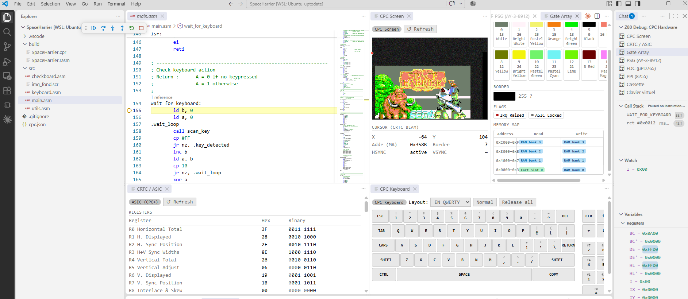

---

## Configuration

### Launch mode (recommended)

The extension starts the emulator, loads the media, and attaches the debugger.

```json
{
  "version": "0.2.0",
  "configurations": [
    {
      "type": "z80",
      "request": "launch",
      "name": "Amstrad CPC - Debug",
      "emulator": "/path/to/Sugarbox",
      "snapshot": "${workspaceFolder}/build/mygame.sna",
      "symbolFile": "${workspaceFolder}/build/mygame.rasm",
      "sourceFile": "${workspaceFolder}/src/main.asm",
      "port": 1234,
      "preLaunchTask": "RASM: assemble"
    }
  ]
}
```

### Attach mode

Attach the debugger to an already-running emulator.

```bash
./Sugarbox --debug --debug_server 1234
```

```json
{
  "type": "z80",
  "request": "attach",
  "name": "Amstrad CPC - Attach",
  "port": 1234,
  "symbolFile": "${workspaceFolder}/build/mygame.rasm"
}
```

### Properties reference

#### `launch` mode

| Property | Type | Default | Description |
|---|---|---|---|
| `emulator` | string | *(required)* | Path to the emulator binary |
| `port` | number | `1234` | TCP port of the debug server |
| `snapshot` | string | — | `.sna` snapshot file to load |
| `disk` | string | — | `.dsk` disk image — drive A |
| `diskB` | string | — | `.dsk` disk image — drive B |
| `tape` | string | — | `.cdt` / `.wav` / `.tzx` tape image |
| `cartridge` | string | — | `.cpr` cartridge (CPC+/GX4000) |
| `configuration` | string | — | Machine profile (e.g. `CPC464`, `CPC+`) |
| `symbolFile` | string | — | RASM symbol file (`.rasm`) — labels in disassembly |
| `sourceFile` | string | — | Main `.asm` source file — source-level debugging |
| `hideEmulator` | boolean | `false` | Hide the emulator window |
| `preLaunchTask` | string | — | VS Code task to run before launch |

#### `attach` mode

| Property | Type | Default | Description |
|---|---|---|---|
| `port` | number | `1234` | TCP port of the debug server |
| `symbolFile` | string | — | RASM symbol file (`.rasm`) |
| `sourceFile` | string | — | Main `.asm` source file |

---

## Usage

### Execution control

| Action | Shortcut |
|---|---|
| Continue | F5 |
| Pause | F6 |
| Step Over | F10 |
| Step Into | F11 |
| Step Out | Shift+F11 |
| Restart | Ctrl+Shift+F5 |
| Stop | Shift+F5 |

**Step Over** intelligently handles `CALL`, `RST`, `DJNZ`, and block instructions (`LDIR`, `LDDR`, etc.) by placing a temporary breakpoint after the instruction rather than stepping into subroutines.

**Step Out** reads the return address from the stack and places a temporary breakpoint on it, resuming until the current subroutine returns.

---

### Source-level debugging

When both `symbolFile` and `sourceFile` are set in `launch.json`, the extension provides source-enriched debugging:

- The disassembly view interleaves the actual `.asm` source lines with the disassembled instructions. Each source line appears above its corresponding instruction, so you can follow the logic in your original code while seeing the exact bytes executed.
- RASM labels from the `.rasm` symbol file are shown at the correct addresses, making jumps and calls readable.
- The current execution position is highlighted both in the disassembly view and, when the PC matches a known source line, in the `.asm` file itself.

```
; src/main.asm line 42
        LD A, (score)
0x5A00  LD A,(0x5C00)    ; 3A 00 5C
; src/main.asm line 43
        CP #FF
0x5A03  CP #FF           ; FE FF
; src/main.asm line 44
        JR Z, game_over
0x5A05  JR Z,0x5A07      ; 28 00

game_over:               ; label from .rasm file
0x5A07  HALT             ; 76
```

Breakpoints can be set directly on `.asm` source lines by clicking the gutter in VS Code, just like in any other language. They are resolved to the corresponding address via the symbol file and applied to the emulator.

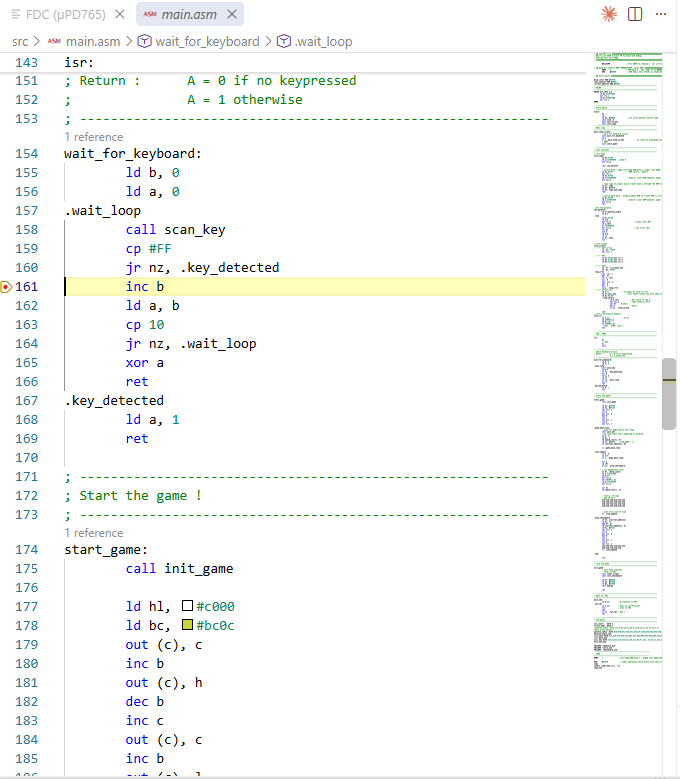

---

### Disassembly view

The extension automatically opens a disassembly view at the current PC address on each stop.

- `Ctrl+Alt+D` — open disassembly at a specific address
- `Ctrl+Alt+M` — open memory view at a specific address

If the emulator supports memory banks (`getMemBanks`), a bank selector is shown at the top of the disassembly window to navigate ROM, RAM, and cartridge pages.

---

### Breakpoints

Three breakpoint types coexist and are merged into a single list sent to the emulator:

- **Disassembly breakpoints** — click the gutter or press `F9` on an instruction line in the disassembly view. These are **persistent**: they survive session restarts and are automatically re-applied on each `configurationDone`.
- **Label breakpoints** — VS Code *Breakpoints* panel → *Add Function Breakpoint*: enter a RASM label (e.g. `game_loop`) or a hex address (`0xBB5A`, `BB5A`, `47962`).
- **Instruction breakpoints** — from VS Code's native Disassembly View (right-click → *Add Breakpoint*).

The command **Z80 Debug: Toggle breakpoint at address / label** (`Ctrl+Shift+P`) lets you add or remove a breakpoint by typing an address or label without opening the disassembly view.

**ED FF breakpoint**: writing the byte sequence `ED FF` into Z80 RAM and executing it triggers an immediate break, useful for software breakpoints injected by the program itself.

---

### Registers and stack

The **Variables** panel exposes:

- **Registers** — all Z80 registers (AF, BC, DE, HL, SP, PC, IX, IY, AF′, BC′, DE′, HL′, I, R). Double-click any register to edit its value.
- **Stack** — top 16 words on the stack with their addresses.

Right-clicking a 16-bit register offers:
- *Open Memory View* — jump to that address in the memory panel
- *Open Disassembly View* — disassemble from that address

---

### Memory view

Right-click a register → *Open Memory View*, or use `Ctrl+Alt+M` and enter an address.

The memory view shows a hex + ASCII grid. You can edit bytes in place by clicking a cell and typing.

If the emulator supports `getMemBanks`, you can switch between memory views (read space, write space, raw RAM banks) using the bank selector dropdown.

---

### Hardware panels

A **Z80 Debug** entry in the VS Code activity bar (left sidebar) gives access to all hardware panels. Panels refresh automatically on every CPU stop.

#### CRTC / ASIC

Shows the state of the CRTC 6845 video controller:

- **Registers R0–R17** with their bitmasks and current values
- **Internal counters**: HCC (horizontal character counter), VLC (vertical line counter), VCC (vertical character counter), MA (memory address)
- **CRTC type** (0–4) and CPC+ mode flag

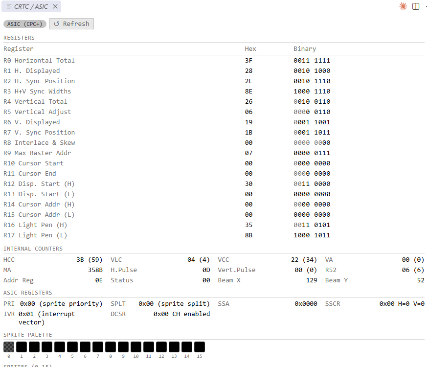

In **CPC+ / ASIC mode**, additional tabs are shown:
- **Sprites** — 16 hardware sprites with their (X, Y) position and 16×16 pixel shape, rendered on a canvas
- **Palette** — 32-entry hardware palette with RGB values
- **DMA** — 3 DMA channels (address, prescaler, loop count, pause)

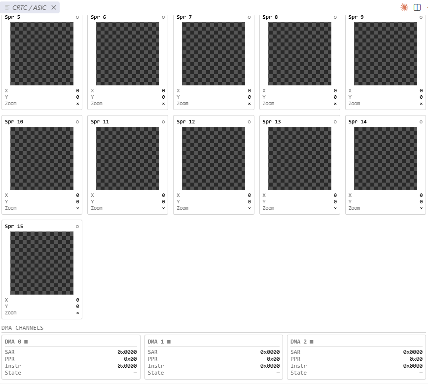

#### Gate Array

Shows the state of the Gate Array (colour / memory controller):

- **Video mode** (0 = 16 colours, 1 = 4 colours, 2 = 2 colours)
- **17 ink colours** — border (ink 16) + 16 palette entries, each shown as a colour swatch with its hardware register value
- **Memory windows** — 4 slots (0x0000–0x3FFF, 0x4000–0x7FFF, etc.) showing whether each maps to ROM or RAM and the bank index
- **Interrupt** — interrupt counter and pending flag

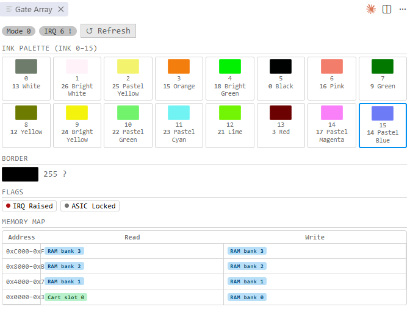

#### PSG (AY-3-8912)

Shows the state of the programmable sound generator:

- **16 registers** (R0–R15)
- **Per channel** (A, B, C): tone frequency, volume, tone/noise enable
- **Noise frequency**
- **Mixer** register decoded per bit
- **Envelope** — frequency and shape register

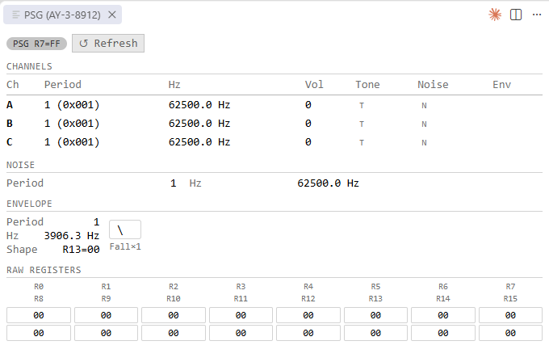

#### PPI (8255)

Shows the state of the programmable peripheral interface:

- **Port A** — PSG data bus value
- **Port B** — CRT VSYNC, tape input, printer busy, expansion port, keyboard row (bit 6 = 50/60 Hz)
- **Port C** — keyboard scan line (bits 0–3), PSG control (bits 6–7)
- **Control word** — mode and direction bits

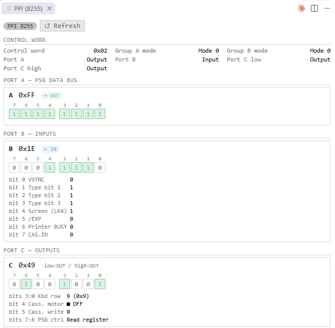

#### FDC (µPD765)

Shows the state of the floppy disk controller:

- **Main status register** — decoded per bit (FDD busy, FDC busy, direction, ready)
- **Current drive** and **motor on** flag
- **Drive 0 / Drive 1** — present, current track, current side, sector list (C/H/R/N/ST1/ST2 for each sector)
- **Raw track viewer** — MFM hex dump of the current track; sectors are highlighted in alternating colours with a legend
- **No disk** state displayed when no disk image is inserted
- **Insert disk** button — opens a file picker to load a `.dsk` image into the selected drive

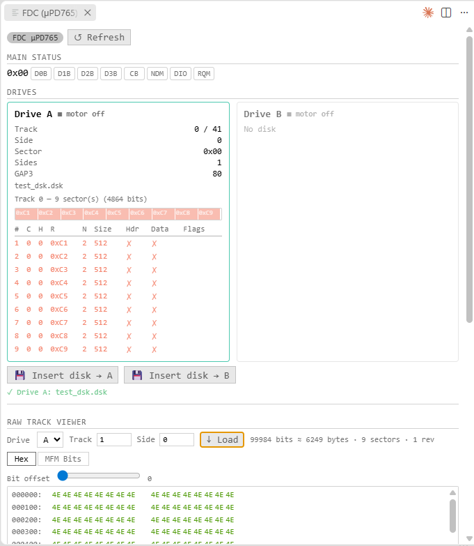

#### Tape

Shows the state of the cassette interface:

- **File path** and **inserted** flag
- **Motor**, **play**, **record** state
- **Counter** (current position) and **length** (total)
- **Block list** — all detected blocks with type, size, and position
- **Signal visualisation** — square-wave diagram of the current tape position

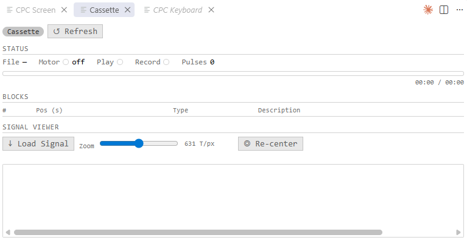

---

### Virtual keyboard

Open via **Z80 Debug: Show Virtual Keyboard** (`Ctrl+Shift+P`).

A rendered CPC keyboard (73 keys) lets you send key presses directly to the emulator without touching the emulator window.

- **Layout selector** — EN (QWERTY), FR (AZERTY), DE (QWERTZ), ES
- **Normal mode** — hold the mouse button to press a key; releasing the mouse releases the key
- **Sticky mode** — click to toggle a key held down (shown in orange); useful for Shift, Ctrl, etc.
- **Release all** button — releases every held key at once

The default layout is controlled by the `z80debug.keyboardLayout` setting.

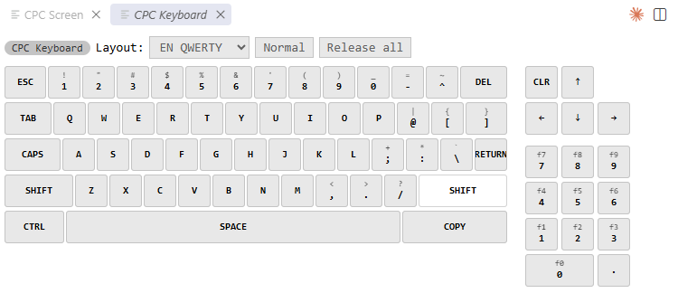

---

### Screen panel

Open via **Z80 Debug: Show Screen** (`Ctrl+Shift+P`).

Displays the live CPC screen output in a VS Code panel

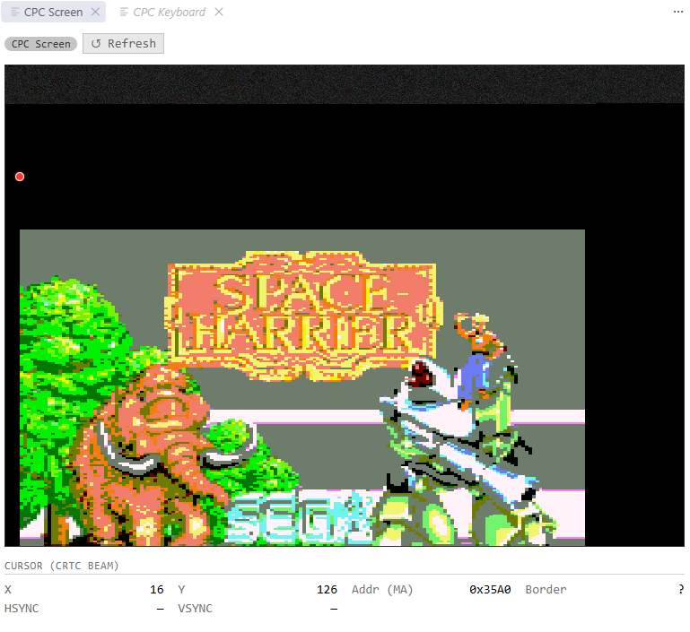

, updated on every CPU stop (or continuously when the emulator is running and screen subscription is active). Useful when `hideEmulator: true` is set and you want to see the display without the emulator window.

---

### Quick Launch

**Z80 Debug: Launch CPC...** (`Ctrl+Shift+P`) — interactive wizard that lets you choose:
- Machine configuration (CPC464, CPC6128, CPC+, etc.)
- Media to load (snapshot, disk A, disk B, tape, cartridge)

The last parameters are remembered and offered at the top of the list for instant relaunch without re-filling the form.

---

### Project creation

**Z80 Debug: New CPC Project...** — generates a complete project skeleton:

- `src/main.asm` — Hello World template or empty skeleton
- `.vscode/tasks.json` — RASM build task (`Ctrl+Shift+B`)
- `.vscode/launch.json` — launch + attach configurations
- `.vscode/settings.json` — project-local settings (emulator path, RASM path)
- `.gitignore`

---

### Hex editor

The extension registers a custom editor for CPC binary files: **SNA**, **DSK**, **CPR**, **CDT**.

Double-clicking one of these files in the VS Code Explorer opens it in the hex editor instead of the default text editor.

**Coloured regions** — the file is parsed and each logical block is highlighted in a distinct colour with a label:
- `.sna` — header (27 bytes), 64 K RAM, optional extended header and extra banks
- `.dsk` — Disk Info Block, then each track (standard format) or per-track blocks (extended format)
- `.cpr` — RIFF header, then each cartridge chunk (`cb00`, `cb01`, …)
- `.cdt` — TZX/CDT header, then each block by type (standard speed, pure tone, pause, …)

A **colour legend** below the hex grid maps each colour to its region name.

**Editing** — click a hex cell and type to edit bytes in place. Modified bytes are highlighted. Changes can be saved (`Ctrl+S`) or reverted.

**Search** — a search bar at the top supports three modes (cycle with the mode button):
- **AUTO** — interprets the input as hex if it looks like hex bytes (`CD 3E` → bytes `0xCD 0x3E`), otherwise as text
- **HEX** — hex bytes only; invalid characters are flagged with an error message
- **TXT** — raw text, each character matched by its ASCII code

Results are highlighted in the grid; use the arrow buttons or `Enter` / `Shift+Enter` to jump between occurrences.

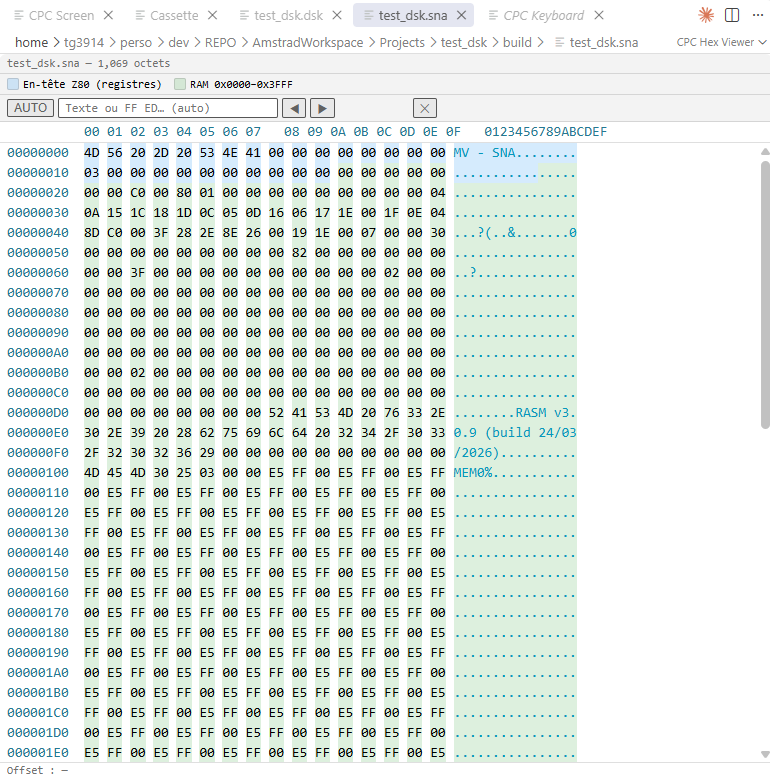

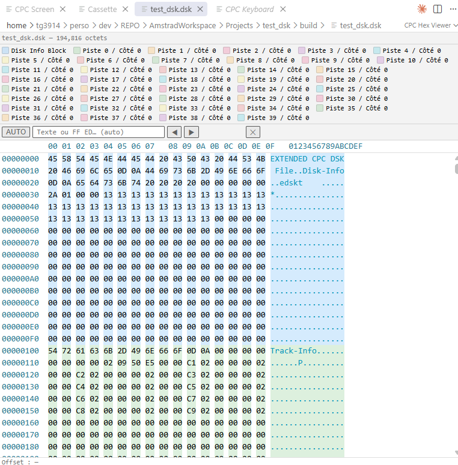

---

## Architecture

```
VS Code (DAP client)
    ↕  DAP inline (stdio)
Z80DebugSession.ts  (debug adapter)
    ↕  JSON/TCP port 1234
CPC Emulator (e.g. SugarboxV2 DebugServer.cpp)
    ↕  direct calls
Z80 CPU / hardware
```

In `launch` mode, the adapter:
1. Spawns the emulator: `<emulator> --debug --debug_server <port> [--cfg <name>] [--hide]`
2. Polls the TCP port until it opens (retry every 250 ms, 10 s timeout)
3. Connects via TCP, then over the debug protocol:
   - sends `insertDisk` for drive A and/or B if specified
   - sends `insertTape` if a tape is specified
   - sends `loadSnapshot` if a `.sna` is specified
4. Sends `InitializedEvent` → VS Code sends `configurationDone` → emulator breaks on entry

---

## Emulator compatibility

The extension works with any emulator that implements the TCP JSON protocol described in [`EMULATOR_INTERFACE.md`](EMULATOR_INTERFACE.md). Hardware panel commands (CRTC, FDC, etc.) are optional: the extension degrades gracefully if they are not supported.

### Known compatible emulators

| Emulator | Platform | Min. version | Notes |
|----------|----------|:------------:|-------|
| [SugarboxV2](https://github.com/Tom1975/SugarboxV2) | Windows · Linux · macOS | 2.1.1 | Reference implementation — full protocol support |

If you implement the protocol in another emulator and want to be listed here, open a PR or an issue.

---

## Conformance tests

The file [`test_conformance.py`](test_conformance.py) is a self-contained protocol test suite that validates any emulator implementing the Amstrad CPC Debug Protocol — not just SugarboxV2.

### Standalone mode — against a running emulator

No pip package required (uses only the Python standard library).

```bash
# Start your emulator with the debug server on port 1234, then:
python3 test_conformance.py --host 127.0.0.1 --port 1234
```

Exit code `0` = all tests passed, `1` = one or more failures.

### pytest mode — automated CI

The test file uses a `client` fixture that depends on a session-scoped `emulator` fixture. You must provide that fixture in a `conftest.py` next to where you run pytest.

SugarboxV2 ships such a `conftest.py` in `Sugarbox/debugers/` — it starts the emulator binary automatically:

```bash
pip install pytest
cd Sugarbox/debugers
pytest z80-debug-adapter/test_conformance.py -v --tb=short
```

Environment variables for the SugarboxV2 conftest:

| Variable | Default | Description |
|---|---|---|
| `SUGARBOX_BINARY` | `../../build/Sugarbox/Sugarbox` | Path to the emulator binary |
| `SUGARBOX_PORT` | `1234` | TCP port of the debug server |

#### Using with another emulator

Create a `conftest.py` that exposes an `emulator` session fixture:

```python
import socket, pytest

@pytest.fixture(scope="session")
def emulator():
    # Start your emulator here, then:
    sock = socket.create_connection(("127.0.0.1", 1234))
    reader = sock.makefile("r")
    yield sock, reader
    reader.close(); sock.close()
    # Stop your emulator here
```

Then run:

```bash
pytest /path/to/z80-debug-adapter/test_conformance.py -v
```

### What is tested

| Group | Commands |
|---|---|
| Protocol basics | unknown command → `error` field |
| Emulator state | `halt`, `continue`, `reset`, `getState`, `subscribeScreen` |
| Registers | `readRegisters`, `setRegisters`, `setPC`, `evaluate` |
| Memory | `readMemory`, `writeMemory`, `getMemBanks` |
| Execution | `step`, `stepIn`, `stepOut`, `setBreakpoints` + hit |
| Disassemble | `disassemble` — count, structure, ordered addresses |
| Hardware state | `getCrtcState`, `getGateArrayState`, `getPsgState`, `getPpiState`, `getFdcState`, `getTapeState` |
| Keyboard | `sendKey` — valid press/release, invalid line/bit → `error` |

---

## Known limitations

- Emulator response timeout: 10 s per command.
